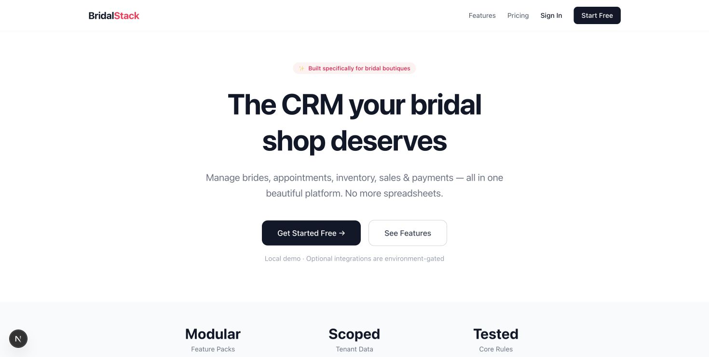
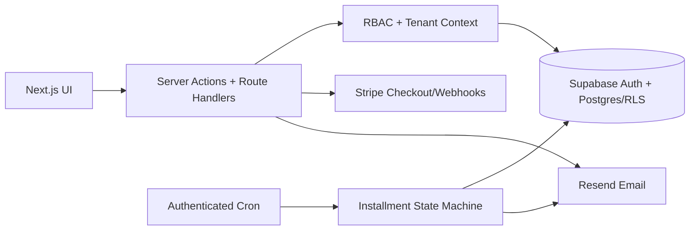

# BridalStack / StackCRM

A multi-tenant CRM prototype for bridal retail operations. It brings customer records, appointments, sales, inventory, contracts, public booking, installments, and role-aware workflows into one Next.js application.

[](https://github.com/moriana55/stackcrm/actions/workflows/ci.yml)
[](https://nextjs.org/)
[](tests)
[](LICENSE)

> Portfolio status: the core domain rules, TypeScript build, lint, and dependency audit are verified locally. Live Supabase, Stripe, Resend, and AI integrations require owner-provided credentials and were not exercised during the repository audit.

## Product evidence

[](docs/screenshots/landing-desktop.png)

Current default-branch landing experience captured locally. External services remain environment-gated; the image is UI evidence, not proof of a hosted production deployment.

## Why this project exists

Bridal retail combines long customer journeys with scheduled fittings, physical inventory, deposits, installments, contracts, and staff-specific access. BridalStack explores how those workflows can share one tenant-scoped operating model without turning every user into an administrator.

## Engineering highlights

- **Fail-closed RBAC:** `owner`, `admin`, `stylist`, and `viewer` roles normalize unknown values to the least-privileged role.
- **Tenant isolation:** Supabase RLS hardening migrations include both `USING` and `WITH CHECK` policies.
- **Public booking guardrails:** UUID, contact, date, time-range, past-date, and overlap validation live in pure, testable functions.
- **Installment state machine:** deterministic plan generation, cent-preserving rounding, due-state derivation, and deduplicated reminder decisions.
- **Environment-gated services:** privileged Supabase, cron, email, payment, and AI credentials remain server-side.
- **Modular product surface:** feature packs control sales, finance, inventory, communication, analytics, and booking capabilities.

## Architecture



Authorization is layered: the proxy refreshes the Supabase session, while pages and API handlers enforce route-specific authentication, role, and tenant checks. Public booking, contract-signature, and customer-portal routes remain intentionally reachable through scoped tokens or validated inputs.

## Verified domain behavior

The test suite currently covers 20 cases across:

- booking happy paths, malformed tenant IDs, invalid time windows, past dates, missing contact data, and collision detection;
- role ranking, permission escalation denial, legacy-role normalization, and unknown-role fallback;
- installment splitting, rounding invariants, minimum counts, due/overdue transitions, and reminder selection.

Run the same quality gates used by CI:

```bash
npm ci
npm run lint
npm test
npm run build
npm audit
```

## Local setup

Requirements: Node.js 24+, npm, and a Supabase project.

```bash
git clone https://github.com/moriana55/stackcrm.git
cd stackcrm
npm ci
cp .env.example .env.local
npm run dev
```

Open `http://localhost:3000`. Apply SQL files in the order documented in [scripts/OWNER-SETUP.md](scripts/OWNER-SETUP.md) before connecting real tenant data.

The production build requires only the two public Supabase values. Optional integrations remain disabled until their server-only variables are supplied.

## Data and security notes

- Never expose `SUPABASE_SERVICE_ROLE_KEY`, Stripe secrets, cron secrets, or AI keys to browser code.
- Apply `scripts/2026-rls-hardening.sql` before the analytics/booking/installment migration.
- The built-in public-route rate limiter is process-local; a distributed deployment should use a shared store such as Redis.
- Staff invitation currently records a placeholder membership. Real email-to-user mapping is intentionally deferred to a service-role-backed admin flow.
- Installment reminders are implemented; automatic recurring card charging is explicitly not implemented.

See [SECURITY.md](SECURITY.md) for reporting and [docs/showcase-audit.md](docs/showcase-audit.md) for the evidence ledger and remaining production gates.

## Stack

Next.js 16 · React 19 · TypeScript · Supabase · PostgreSQL/RLS · Stripe · Resend · Tailwind CSS · Recharts · Node test runner

## License

[MIT](LICENSE)
